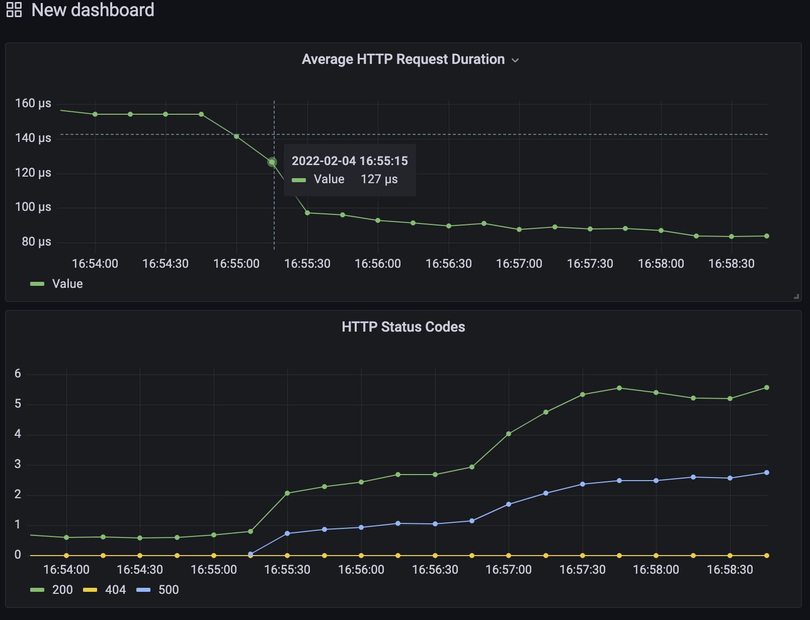

# SRE Instrumentation Challenge

Your goal is to add Prometheus instrumentation to our in-memory Storage API which is written in Python (see `src/README.md` for more details).

**Please invest no more than 5 to 8 hours.** If you cannot complete the task in this time frame, document where you got stuck so we can use this as a basis for discussion for your next interview.

## Your mission, should you choose to accept it:

### Step 1: Implementation

- Add the Prometheus metrics endpoint to the Storage API
- Expose HTTP request duration in seconds by path, method and status code
- Create a Dockerfile for the Storage API. The Prometheus Server expects it to run on `http://storage_api:5000`.
- Add the newly dockerized Storage API to our docker-compose setup

### Step 2: Visualization

1. Run `docker-compose up`
2. Create a new Grafana dashboard here: http://localhost:3000
3. The dashboard should contain two graphs for our Storage API:

- Average HTTP Request Duration
- HTTP Status Codes

It should look something like this:

Tip: Run `scripts/generate_traffic.sh` to generate some traffic to the Storage API . The script expects the Storage API to run on http://localhost:5000.

4. Try to figure out why you see HTTP 500 errors for some endpoints

### Step 3: Deployment

In the last step we want to run the setup we have from our `docker-compose.yml` file on Kubernetes. Please create the Kubernetes resources for

- Storage API application
- Prometheus
- Grafana

How you create or generate the resource files (YAML files) is up to you. Depending on the time left, it is fine to take shortcuts or only creating the resource files without actually applying them to a Kubernetes cluster. Also don't invest much time into the volume setup.

## Evaluation criteria

What we're looking for:

- We expect the resulting Storage API to be equally simple. Even if you don't know Python, the Flask and Prometheus documentation should provide enough guidance
- The Dockerfile and your changes to docker-compose.yml are sensible and concise. You can talk about the pros and cons of your setup in relation to convenience vs security.
- It works reliably. `docker-compose up` and your documentation should be all that is required to review your solution
- Scratch features when necessary, time is short!
- Document your approach, your decisions, and your general notes
